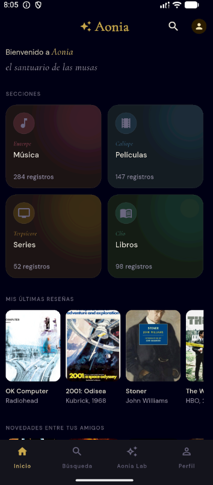
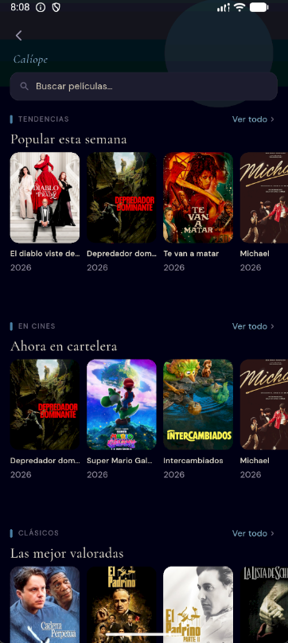
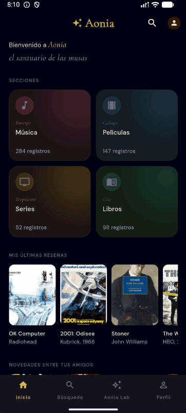
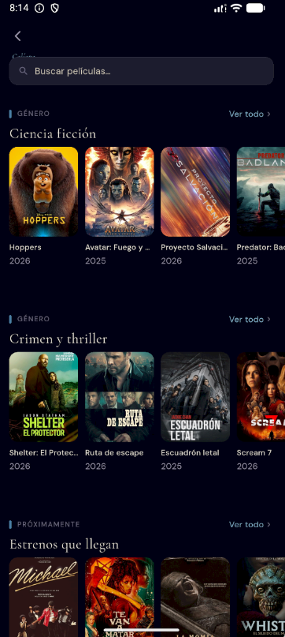

<div align="center">
  <h1>Aonia</h1>

  <p><em>A personal cultural companion for films, series, music & books</em></p>

  <p>
    
    
    
    
  </p>

  <p>
    <strong>Final Year Project (TFC) — Higher Degree in Multiplatform Application Development (DAM)</strong><br/>
    <em>IES Islas Filipinas · Madrid · 2025–2026</em>
  </p>

</div>

---

> **⚠️ Early stage.** This repository documents an app in active development as part of my academic final project. UI, features and architecture are **subject to change**. Screenshots reflect the current state of a real, working build.

---

## What is Aonia?

**Aonia** is a multiplatform app for registering, contextualising and discovering cultural experiences across four content types: **films, series, music albums and books**.

The name references the ancient Greek region of Boeotia — home of the Muses — as a nod to the world of arts and culture the app orbits.

The goal is not just another watchlist. Aonia aims to be a reflective space where you can log what you've watched, listened to or read, add personal notes and ratings, and eventually find meaningful connections between works across different media.

---

## Current state (what you can see right now)

The app is in early development. The following has been implemented so far:

### ✅ Design system
A custom Flutter design system built from scratch — dark palette, `Cormorant Garamond` for editorial moments, `DM Sans` for UI, and per-section colour accents (film in blue, music in rose, series in amber, books in green). No third-party UI libraries.

> 📸 **[Screenshot — Design system / colour palette]**
> 

---

### ✅ Films page — live API integration
The films section fetches real data from the [TMDB API](https://www.themoviedb.org/documentation/api) in parallel:

- Trending today
- Now playing in cinemas
- Top rated of all time
- By genre (user-selectable filter)
- Upcoming releases

All rendered in horizontally scrollable poster rows with gold star ratings and a consistent 2:3 card format.

> 📸 **[Screenshot — Films page, trending row]**


> 🎬 **[GIF — Scrolling through genre filter]**
 

---

### 🔧 In progress

| Feature | Status |
|---|---|
| Music page (Spotify Web API) | 🔄 In progress |
| Books page (Google Books API) | 🔄 In progress |
| Series page (TMDB) | 📋 Planned |
| Navigation between screens | 📋 Planned |
| Firebase Auth (sign in / sign up) | 📋 Planned |
| Firestore — personal library & ratings | 📋 Planned |
| Aonia Lab *(see below)* | 🔭 Future vision |

---

## Future vision — Aonia Lab

Aonia Lab is the experimental heart of the app. It's an open-ended exploration space — still being shaped — that will bring together ideas around:

- Cross-media contextualisation (e.g. the book behind the film, the album of an era)
- Personal reading and viewing patterns over time
- Enriched, multimedia cultural context
- Discovery through unexpected connections

The exact form this takes will evolve as the rest of the app matures.

---

## Tech stack

| Layer | Technology |
|---|---|
| Frontend | Flutter / Dart |
| Backend & database | Firebase (Firestore + Auth) |
| Films & series data | TMDB API |
| Music data | Spotify Web API |
| Books data | Google Books API |
| Design & prototyping | Figma |

---

## Architecture (early stage)

The project follows a simple, pragmatic structure that will be refactored as complexity grows:

```
lib/
├── theme/
│   ├── app_colors.dart       # Colour constants
│   ├── app_text_styles.dart  # Typography constants
│   └── app_theme.dart        # ThemeData
├── pages/
│   └── films_page.dart       # Films UI + TmdbService (to be extracted)
└── main.dart
```

Service classes are currently co-located with their pages for simplicity. Extraction into `lib/data/services/` is a planned refactor once more pages are added.

---

## Project context

This app is being developed as a solo final year project (TFC) for a **Higher Degree in Multiplatform Application Development (DAM)** at IES Islas Filipinas, Madrid. Development follows an agile/Scrum methodology with sprints, a Trello Kanban board, and Fibonacci story points for academic deliverables.

I'm learning Flutter and Dart from scratch throughout this project — intentionally, as a way to demonstrate the ability to pick up a new framework under real constraints and produce something with genuine design care.

---

## Screenshots

*Will be updated progressively as the app grows.*

| Films — Trending | Films — Genre filter | Design system |
|:---:|:---:|:---:|
|  |  |  |

---

<div align="center">
  <sub>Built with Flutter · Powered by TMDB, Spotify & Google Books · © 2026 César</sub>
</div>
